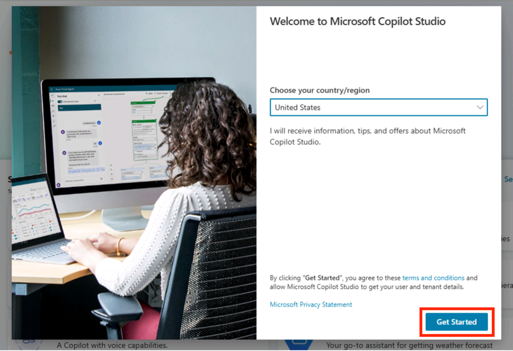

# @lab.Title

In this 75-minute hands-on workshop, you'll experience the complete journey of building an intelligent agent using Microsoft Copilot Studio. Through a practical inventory and order management scenario, you'll learn how to create a sophisticated AI assistant capable of handling real-world business operations.

## What You'll Learn

By the end of this workshop, you'll have practical experience with:

- **Agent Design & Architecture**: Understanding how to design purpose-driven agents that solve specific business problems
- **Knowledge Integration**: Adding and managing knowledge bases to make your agent contextually aware
- **Advanced Automation**: Building Agent Flows to handle deterministic, complex, multi-step business processes
- **External System Integration**: Connecting your agent to external services using Model Context Protocol (MCP) servers
- **Production Deployment**: Publishing and configuring your agent for real-world use

## Workshop Scenario

You are a solutions architect tasked with modernizing the customer service experience for Zava Retail Store, a beloved regional retailer serving suburban communities.
Currently, customers call or email to check inventory, place orders, and track shipments—creating bottlenecks for both customers and staff. Your mission is to build an intelligent Inventory Assistant that can:

- Answer product availability questions instantly
- Guide customers through the ordering process
- Provide real-time inventory updates
- Handle order modifications and cancellations
- Escalate complex issues to human agents when needed

The green text with the +++icon+++ can be clicked on and will be typed automatically into the VM, For example, please click in the password text box and then click the password: <+++@lab.VirtualMachine>(WRK530).Password+++

> [!note] To ensure text is entered accurately avoid interacting or clicking in the VM until the text has finished being typed

===

## 1 - Build the Agent Foundation

To start, you're going to setup the foundation for your agent in Copilot Studio.

1. Open Microsoft Edge and navigate to

    +++<https://copilotstudio.microsoft.com+++>

1. Log in with

    <!-- markdownlint-disable-next-line MD034 -->
    **Username:** +++@lab.CloudCredential(CSBatch1).UserPrincipalName+++

    <!-- markdownlint-disable-next-line MD034 -->
    **Password:** +++@lab.CloudCredential(CSBatch1).Password+++

    <!-- markdownlint-disable-next-line MD034 -->
    **Temporary Access Password:** +++@lab.Variable(TAP)+++

1. If you see a welcome screen like is shown below, select the country/region that you’re in from the dropdown and select Get Started

    

1. If you see a welcome message as shown in the screenshot below, select Skip.

    

1. Click the Environment drop down in the top right and then select the Dev environment ENV{LAB_INSTANCE_ID}

    

1. In the left nav click **+ Create** button to start creating a new agent

    

1. Click **New agent**

    

1. While we could use natural language to setup the agent for this exercise, we will skip directly to the configuration Click the Skip to configure button

    

1. In the name field, type +++Zava Order Support+++ and then click the **Create** button

    

1. Now we need to confirm and configure some settings for our agent. To do that, select the **Settings** button in the top right hand corner

    

1. In the Generative AI tab, confirm that **Generative Orchestration** is set to **Yes** and turn **Connected Agents** to **On** then select **Save**

    

1. Select the **Security** tab in the left navigation

    

1. Select **Authentication**

    

1. Select **No Authentication** and select the **Save** button to apply the settings.

    

Congratulations! You have the foundation setup for your agent. Now you can add tools and knowledge.

===

## 2 - Connecting to the MCP Server

In the previous step, you created the foundation of your Inventory Assistant Agent. Right now, your agent is like a helpful employee who knows nothing about your actual business. So now, it's time to give your agent real intelligence by connecting it to live business data so customers can get real answers about inventory, orders, and pricing.

How will we do this? With MCP. MCP (Model Context Protocol) is your agent's connection to the real world. Think of it as a secure bridge that lets your agent:

- Read live inventory data from your warehouse management system
- Write new order information when customers make purchases
- Update stock levels in real-time as orders are processed
- Access customer order history and preferences

Let's get started connecting to the inventory MCP server.

1. First step

===

## 3 - Creating the Order Approval Agent Flow

The agent needs to handle Zava's complex business rules that include multi-stage approvals and conditional logic. This requires that we use Agent Flow approval capabilities which we'll add in this step.

1. Do this first

===

## 4 - Test and Publish Your Agent

Now that you have confirmed your agent is working as expected let’s publish the agent. We'll publish to the demo website which simulates what your agent would look like if it was published to a public website.

1. Click the **Publish** button in the top right-hand corner

    

1. Click the **Publish** button to publish your agent

    

    The following dialog will be displayed you can close this and your agent will finish publishing in the background

    

1. Now that it’s published, we need to make this available to use within Microsoft Teams. Select the **Channels** tab in the top menu

   

Congratulations! You’ve now built and published an agent!

===

Nothing will be graded so feel free to submit and close out of the VM. If you finished the workshop you get an A+!
